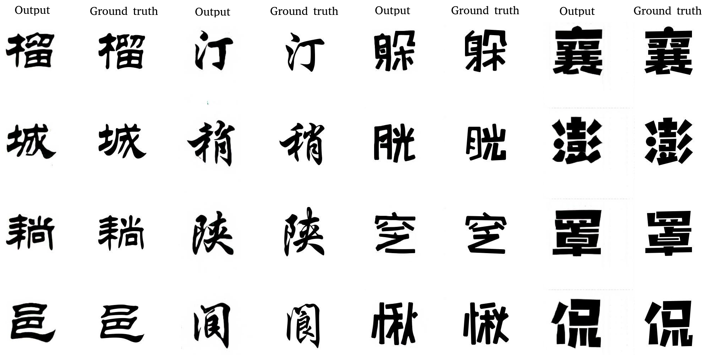
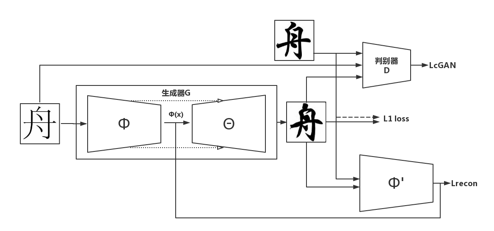
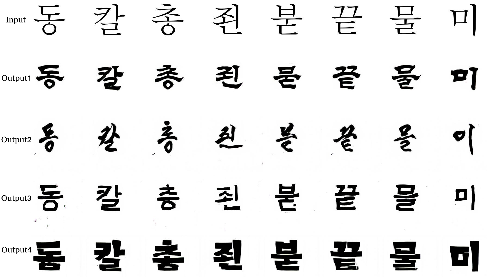

# font2font: Learning Chinese Calligraphy with Conditional Adversarial Networks

<p align="center">
    
</p>

## Introduction
Learning Eastern Asian language fonts with conditional adversarial networks. This is an extension of the recent work "Image-to-image translation with conditional adversarial networks" by Isola P. et al.

## Model
<p align="center">
    
</p>
The network is based on conditional adversarial networks, with the addition of L1 loss and semantic reconstruction loss (Lrecon), which is inspired by the recent work "Perceptual losses for real-time style transfer and super-resolution" by Johnson J. et al.

Currently, the network is only capable of performing one-to-one font style transfer. We may extend it to support one-to-many style transfer in the future.

## Experiment
### Chinese Characters
<p align="center">
    
</p>
Training: 3000 Chinese characters.

### Korean Characters
<p align="center">
    
</p>
Training: 3000 Chinese characters.

Notably, the network has never seen any Korean characters before the inferring stage. The experiment shows that our network is capable of performing style transfer on previously unseen characters.

## Setup
### Prerequisites
- Linux or OSX
- NVIDIA GPU + CUDA CuDNN

### Getting Started
- Download the fonts (.ttf or .otf)
- Generating corresponding images for the fonts, call:
```bash
python script/generate.py --src_font=xxx.ttf --dst_font=xxx.otf --charset=CN --shuffle=1 --filter=1 --sample_count=3000 --sample_dir=.
```

### Train
```bash
DATA_ROOT=/path/to/data/ name=expt_name which_direction=AtoB th train.lua
```
Switch `AtoB` to `BtoA` to train translation in opposite direction.
See `opt` in train.lua for additional training options.

### Test
```bash
DATA_ROOT=/path/to/data/ name=expt_name which_direction=AtoB phase=val th test.lua
```
See `opt` in test.lua for additional testing options.

